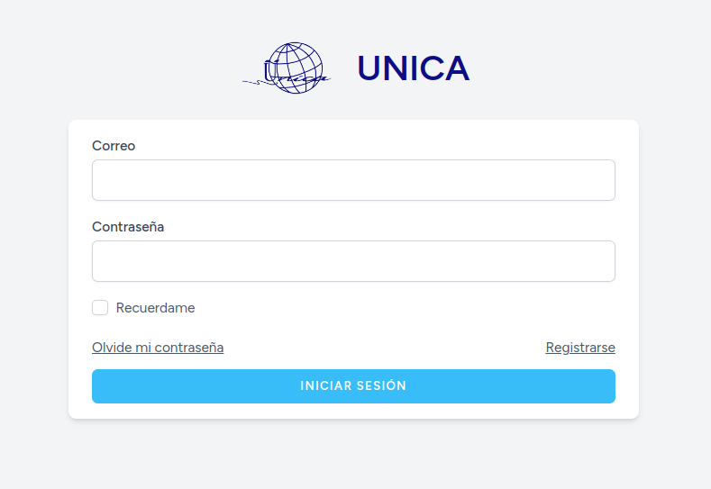
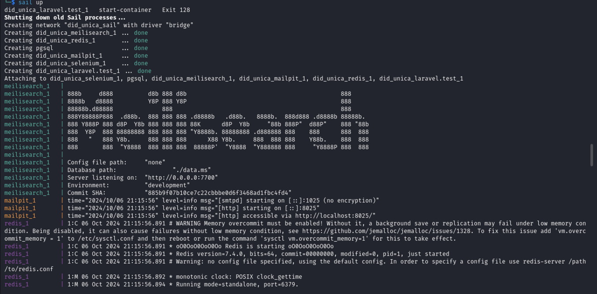
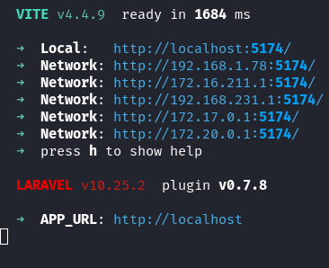

# Servicio Social
Proyecto web. Login para la página de servicio social del DID de UNICA. Enlace de la pagina: https://XXXXXXXXX.com/index.php



## Instalación - Desarrollo

### Dependencias
- `node >= 16.0.0`
- `npm`
- `php >= 8.0`
- `php-xml`
- `php-curl`
- `composer`
- `docker`

---

### Pasos de Instalación

1. **Clonar el repositorio**

   ```sh
   git clone https://github.com/Karla-Lopez-Carrasc/servicio-social/
   cd servicio-social
   ```

2. **Cambiar a la rama de desarrollo**

   ```sh
   git switch develop
   ```

3. **Instalar dependencias del proyecto**

   ```sh
   composer install
   npm install
   ```

4. **Configurar el archivo de configuración**

   Copia el archivo de ejemplo `.env`:

   ```sh
   cp .env.example .env
   ```

5. **Iniciar los contenedores con Sail**

   Para iniciar los contenedores, ejecuta:

   ```sh
   ./vendor/bin/sail up
   ```

   > **NOTA:** Agrega un alias para ejecutar solo `sail` y no la ruta completa. Edita tu archivo `~/.bashrc` o `~/.zshrc`:

   ```sh
   alias sail='./vendor/bin/sail'
   ```

   Luego, recarga la configuración:

   ```sh
   source ~/.bashrc ó ~/.zshrc
   ```

6. **Ejecutar las migraciones**

   ```sh
   sail artisan migrate --seed
   ```

   Debería verse algo así:

   

7. **Iniciar el servidor de desarrollo de Vite**

   ```sh
   npm run dev
   ```

   - Si no se está realizando desarrollo front-end, ejecuta:

   ```sh
   npm run build
   ```

   - Si Vite no carga los estilos, limpia la caché.
   - Si cambiaste alguna ruta, ejecuta:

   ```sh
   sail artisan route:cache
   ```
   
   

## Uso de Git Flow

1. **Instalar Git Flow** desde el siguiente [repositorio](https://github.com/nvie/gitflow#git-flow) y ejecutar:

   ```sh
   git flow -d
   ```

2. **Iniciar una nueva funcionalidad:**

   ```sh
   git flow feature start <nombre_funcionalidad>
   ```

3. **Finalizar la rama y hacer merge:**

   ```sh
   git flow feature finish <nombre_funcionalidad>
   ```

4. **Realizar un push:**

   ```sh
   git push
   ```

[Más información](https://www.atlassian.com/es/git/tutorials/comparing-workflows/gitflow-workflow)

### Q&A :question: :question:

### Error: `laravel.test port is already in use`

Verifica que el puerto 80 no esté en uso por otro servicio, como Apache. Puedes cambiar el puerto o desinstalar Apache.

### Error: `mysql exit code 1`

Si MySQL no se inicia, ejecuta:

```sh
sail stop
sail down
docker images rmi <imagen-mysql>
docker volume rm <volumen-mysql>
sail up
```

[Fuente](https://stackoverflow.com/questions/73217146/mysql-container-keep-not-connecting-to-my-container)

### Error: `npm run dev` no ejecuta correctamente

Asegúrate de tener `node >= 16.0.0`. Si es necesario, actualízalo:

```sh
sudo npm install -g n
n lts
node -v
```

> En caso de no poder ejecutar `n` con `sudo`, reinicia el sistema.

### Error: `no such file or directory: ./vendor/bin/sail`

```
┌──(usuario㉿host)-[~/…/UNICA_DID/DID_UNICA/vendor/bin] 
└─$ ./vendor/bin/sail up

zsh: no such file or directory: ./vendor/bin/sail
```

Si parece que no puedes encontrar el archivo `sail`. Esto puede deberse a que Sail no se ha instalado correctamente o a que estás en el directorio incorrecto. Aquí tienes algunos pasos para solucionar el problema:

### 1. Verifica la ubicación

Asegúrate de estar en el directorio raíz de tu proyecto Laravel, donde debería encontrarse la carpeta `vendor`. Puedes verificarlo con:

```sh
ls
```

Deberías ver la carpeta `vendor` entre otras.

### 2. Instala Sail

Si la carpeta `vendor` no tiene el archivo `sail`, asegúrate de que has ejecutado correctamente el comando para instalar Sail. Desde el directorio de tu proyecto, ejecuta:

```sh
composer require laravel/sail --dev
```

Después de instalar, verifica que el archivo `sail` exista:

```sh
ls vendor/bin
```

Deberías ver `sail` en la lista.

### Error: `Install or enable PHP's http extension`

```
┌──(usuario㉿host)-[~/…/UNICA_DID/DID_UNICA/vendor/bin]
└─$ composer require laravel/sail --dev

PHP Warning:  Module "xml" is already loaded in Unknown on line 0
PHP Warning:  Module "curl" is already loaded in Unknown on line 0
PHP Warning:  Module "gd" is already loaded in Unknown on line 0
PHP Warning:  Module "http" is already loaded in Unknown on line 0
PHP Warning:  Cannot load module "http" because required module "raphf" is not loaded in Unknown on line 0
No composer.json in current directory, do you want to use the one at /home/bante/Documents/UNICA/UNICA_DID/DID_UNICA? [Y,n]? y
Always want to use the parent dir? Use "composer config --global use-parent-dir true" to change the default.
./composer.json has been updated
Running composer update laravel/sail
Loading composer repositories with package information
Updating dependencies
Your requirements could not be resolved to an installable set of packages.

  Problem 1
    - Root composer.json requires PHP extension ext-http * but it is missing from your system. Install or enable PHP's http extension.

To enable extensions, verify that they are enabled in your .ini files:
    - /etc/php/8.2/cli/php.ini
    - /etc/php/8.2/cli/conf.d/10-opcache.ini
    - /etc/php/8.2/cli/conf.d/10-pdo.ini
    - /etc/php/8.2/cli/conf.d/15-xml.ini
    - /etc/php/8.2/cli/conf.d/20-calendar.ini
    - /etc/php/8.2/cli/conf.d/20-ctype.ini
    - /etc/php/8.2/cli/conf.d/20-curl.ini
    - /etc/php/8.2/cli/conf.d/20-dom.ini
                    .
                    .
                    .
    - /etc/php/8.2/cli/conf.d/20-xmlreader.ini
    - /etc/php/8.2/cli/conf.d/20-xmlwriter.ini
    - /etc/php/8.2/cli/conf.d/20-xsl.ini
    - /etc/php/8.2/cli/conf.d/20-zip.ini
    - /etc/php/8.2/cli/conf.d/25-http.ini
You can also run php --ini in a terminal to see which files are used by PHP in CLI mode.
Alternatively, you can run Composer with --ignore-platform-req=ext-http to temporarily ignore these required extensions.
You can also try re-running composer require with an explicit version constraint, e.g. "composer require laravel/sail:*" to figure out if any version is installable, or "composer require laravel/sail:^2.1" if you know which you need.

Installation failed, reverting ./composer.json and ./composer.lock to their original content.
```

Este mensaje de error indica que te falta la extensión `http` de PHP, la cual es necesaria para instalar Laravel Sail. Aquí tienes los pasos para solucionar este problema:

1. Instalar la extensión `http`

Dado que la extensión `http` no está instalada, puedes hacerlo utilizando el siguiente comando:

```bash
sudo apt-get install php8.2-http
```

Asegúrate de reemplazar `8.2` con la versión de PHP que estás usando, si es diferente.

2. Verificar las extensiones

Asegúrate de que las extensiones `xml` y `curl` también están habilitadas. Puedes instalar las extensiones necesarias con:

```bash
sudo apt-get install php8.2-xml php8.2-curl php8.2-gd
```

3. Reiniciar el servidor web (si es necesario)

Si se está usando un servidor web Apache o Nginx, reinícialo:

```bash
sudo systemctl restart apache2/nginx
```

4. **Verifica la instalación**

Ejecuta el siguiente comando para verificar que las extensiones están habilitadas:

```bash
php -m | grep -E 'http|xml|curl|gd'
```

Y deberías ver las extensiones en la lista.

5. **Reintentar la instalación de Sail**

Ahora, regresa al directorio de tu proyecto y ejecuta nuevamente el comando:

```bash
composer require laravel/sail --dev
```

6. **(Opcional) Ignorar requisitos de plataforma**

Si no puedes instalar la extensión `http` por alguna razón, como alternativa temporal, puedes ignorar el requisito usando:

```bash
composer require laravel/sail --dev --ignore-platform-req=ext-http
```

Esto no es recomendable para un entorno de producción, pero puede funcionar para propósitos de desarrollo.

### Error: Cannot load module "http" because required module "raphf" is not loaded in Unknown on line 0

```
┌──(usuario㉿host)-[~/Documents/UNICA/UNICA_DID/DID_UNICA]
└─$ php -m | grep "http"
PHP Warning:  Module "xml" is already loaded in Unknown on line 0
PHP Warning:  Module "curl" is already loaded in Unknown on line 0
PHP Warning:  Module "gd" is already loaded in Unknown on line 0
PHP Warning:  Module "http" is already loaded in Unknown on line 0
PHP Warning:  Cannot load module "http" because required module "raphf" is not loaded in Unknown on line 0
```

El error que estás viendo indica que el módulo `http` no se puede cargar porque le falta el módulo `raphf`, que es una dependencia necesaria. Aquí tienes los pasos para solucionarlo:

1. **Instalar la extensión `raphf`**

Primero, necesitas instalar la extensión `raphf`. Puedes hacerlo ejecutando:

```bash
sudo apt-get install php8.2-raphf
```

2. **Verificar la instalación**

Después de instalar `raphf`, verifica que esté correctamente instalado:

```bash
php -m | grep "raphf"
```

3. **Habilitar las extensiones en el archivo `php.ini`**

Asegúrate de que las extensiones `http` y `raphf` estén habilitadas. Abre el archivo de configuración `php.ini` para CLI:

```bash
sudo nano /etc/php/8.2/cli/php.ini
```

Asegúrate de que las siguientes líneas estén presentes y no estén comentadas:

```ini
extension=raphf
extension=http
```

4. **Reiniciar la terminal**

No necesitas reiniciar ningún servicio, pero cierra y vuelve a abrir la terminal para asegurarte de que los cambios surtan efecto.

5. **Verificar nuevamente**

Ejecuta nuevamente:

```bash
php -m | grep -E "http|raphf|xml|curl|gd"
```

Asegúrate de que todos los módulos estén listados sin errores.

6. **Reintentar la instalación de Sail**

Ahora que deberías tener todas las extensiones necesarias, vuelve a intentar instalar Laravel Sail:

```bash
composer require laravel/sail --dev
```

### Error: `Failed to restart apache2.service: Unit apache2.service not found.`

```                                                                                                                                                          
┌──(usuario㉿host)-[~/Documents/UNICA/UNICA_DID/DID_UNICA]
└─$ sudo apt-get install php8.2-xml php8.2-curl php8.2-gd

Reading package lists... Done
Building dependency tree... Done
Reading state information... Done
php8.2-xml is already the newest version (8.2.23-1).
php8.2-curl is already the newest version (8.2.23-1).
php8.2-gd is already the newest version (8.2.23-1).
The following packages were automatically installed and are no longer required:
  libobjc-13-dev libpcre3 libpoppler134 libpython3.11-dev libpython3.11-minimal libpython3.11-stdlib libpython3.11t64 libvpx8 python3-lib2to3 python3.11
  python3.11-dev python3.11-minimal
Use 'sudo apt autoremove' to remove them.
0 upgraded, 0 newly installed, 0 to remove and 630 not upgraded.
                                                                                                                                                                      
┌──(usuario㉿host)-[~/Documents/UNICA/UNICA_DID/DID_UNICA]
└─$ sudo systemctl restart apache2

Failed to restart apache2.service: Unit apache2.service not found.
```

Esto indica que parece que no estar `Apache` instalado, lo cual es normal si estás utilizando solo `PHP` y `Docker` para tu proyecto. En este caso, lo que necesitas es asegurarte de que las extensiones están habilitadas en la configuración de `PHP` para la línea de comandos (CLI).

1. **Verifica las extensiones de PHP**

Ejecuta el siguiente comando para listar las extensiones cargadas:

```bash
php -m
```

Asegúrate de que `http`, `xml` y `curl` estén en la lista. Si no están, necesitarás habilitarlas.

2. **Habilitar extensiones manualmente**

Si las extensiones están instaladas pero no habilitadas, puedes habilitarlas manualmente:

1. **Editar el archivo `php.ini`:**

   Abre el archivo de configuración de PHP para CLI. Dependiendo de tu instalación, la ruta puede ser diferente. Prueba con:

   ```bash
   sudo nano /etc/php/8.2/cli/php.ini
   ```

   Busca las líneas que contienen `extension=http`, `extension=curl`, y `extension=xml`. Si están comentadas (con un `;` al inicio), quítale el `;`.

2. **Revisa los archivos de configuración adicionales:**

   También puedes revisar los archivos en `conf.d` para asegurarte de que las extensiones están habilitadas. Por ejemplo:

   ```bash
   ls /etc/php/8.2/cli/conf.d/
   ```

   Busca archivos que contengan `http.ini`, `curl.ini`, y `xml.ini`. Asegúrate de que existan y estén configurados correctamente.

3. **Reinicia el servicio PHP (si corresponde)**

Como no tienes Apache, no necesitas reiniciarlo. Sin embargo, si usas otro servidor web (como Nginx), asegúrate de reiniciarlo.

4. **Reintentar la instalación de Sail**

Regresa a tu proyecto y vuelve a intentar instalar Sail:

```bash
composer require laravel/sail --dev
```

Si sigue sin funcionar, prueba ejecutar el siguiente comando para ignorar la falta de la extensión `http` temporalmente:

```bash
composer require laravel/sail --dev --ignore-platform-req=ext-http
```

5. **Verifica la instalación**

Si la instalación se realiza correctamente, asegúrate de que el archivo `sail` esté presente en `vendor/bin`. Puedes verificarlo con:

```bash
ls vendor/bin
```

